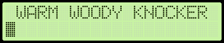

<h1 align="center">
	
</h1>

**WARM WOODY KNOCKER** is an Arduino based metronome that uses solenoids beating a wooden box to produce sound.

## Features

* Wide range of tempos.

* Linear rhytms. Meter and subdivision are both configurable, so anything between 1/4 and 16/16 is possible.

* Irregular patterns like Clave, Songo or Saiidi. Swing rhytms can be simulated in this mode as well. Patterns of arbitrary length and subdivision are supported. Two "tracks" (each controlling it's own actuator) with three sound levels each (off / regular / accented) are available while programming a pattern. (TODO: wiki page)

* Volume adjustment (TODO: wiki page). Level range is quite wide in theory, but not the whole range gives stable result, because of mechanics instability.

## Building the project

A prototype was developed within a day in Arduino IDE, and it naturally became a 1000+ LOC single-file mess. That was an obvious signal for me to run away and rework it from scrach keeping in mind all known best practices.

The project is being developed in [VSCode](https://code.visualstudio.com/) with [Arduino](https://marketplace.visualstudio.com/items?itemName=vsciot-vscode.vscode-arduino) plugin. You can build and upload the sketch via Arduino IDE, but the process of development is such a pain without all the features and tools you used to see in a modern IDE, that's why I highly recommend VSCode. To get started with using VSCode for Arduino development, check one of these: [[one]](https://learn.sparkfun.com/tutorials/efficient-arduino-programming-with-arduino-cli-and-visual-studio-code/all), [[two]](https://medium.com/home-wireless/use-visual-studio-code-for-arduino-2d0cf4c1760b).

If your hardware is close enough to the original [schematics](##Schematics), you may just build the project as-is. If not, some [configuration](###Configuration) my be needed.

There are just two external dependenciaes, that must be pre-installed before building the project. They are `Arduino` and `LiquidCrystal`. If you have Arduino IDE installed, both of them should be already available. To make sure about the second, use "Manage Libraries" menu in Arduino IDE, or "Arduino: Library Manager" command in VSCode.

### Configuration

Configure your display size. Currently only 2-line text-based HD44780-compatible displays are supported (via LiquidCrystal). One line is used for animation and another one for toggling and configuration of parameters. Bigger displays can be adopted easily.

```cpp
uint8_t const lcdLineWidth = 16;
uint8_t const lcdLinesCount = 2;
```

Set respective pins you use to connect peripherals:

```cpp
// ==== warm_woody_knocker.ino ====

uint8_t const encoderPinA = 10;            // Arduino digital IO pin connected to SW1 A pin
uint8_t const encoderPinB = 11;            // Arduino digital IO pin connected to SW1 B pin
uint8_t const buttonPin = 12;              // Arduino digital IO pin connected to SW1 S2 pin

//                RS   E  D4  D5  D6  D7   // DS1 pin
LiquidCrystal lcd( 7,  6,  5,  4,  3,  2); // Arduino digital IO pin

// ==== Player.cpp ====

uint8_t const lowChannelPin = 8;           // Arduino digital IO pin connected to Q1 gate
uint8_t const highChannelPin = 9;          // Arduino digital IO pin connected to Q2 gate
```

If you have instability issues with the button or rotary encoder, try fine-tuning debounce thresholds values. Keep in mind, that by increasing these values, you limit the maximum supported speed of encoder rotation / button clicking.

```cpp
// ==== warm_woody_knocker.ino ====

uint32_t const spinThreshold = 5;
uint32_t const buttonClickThreshold = 40;
```

## Hardware part

### Supported hardware

Any Arduino-compatible board should work. Original version of WWK was build on Seeeduino v3.0 (clone of Duemilanove). Currently an Arduino Nano board is used for development of v2.

### Schematics

All values are given for reference and can be changed in a wide range without affecting functionality.

[<br>**v1** schematics](./images/schematics_v1.png)

* U1 is optional and may be removed if your transformer gives no more than 12v. In that case, display power should be connected to Arduino 5V output. The original WWK build was intended to work all day long, that's why it is mains powered.

* Q1 and Q2 are any N-channel MOSFETs that can be driven by logic levels. The parts I've used seems to be an overkill, but that was what I had around without any use.

### Construction

Original WWK was built inside a wooden box, that used to be a mic case some day. Front panel with Arduino board attached and the transformer are fixed on one half of the box, and the power board with solenoids are on the another half. With power wire detached, the box can be locked with the original latch which makes it safe to carry the device.

Electromagnetic actuators (push type) are pointed to one of the box walls. Having two separate actuators makes possible to play accents or patterns. It's a tricky part of building the WWK to find appropriate spot on the wall to hit by actuators and adjust the gap between them. Even small shift may give big difference in sound. When adjusting the gap, you should also check different pulse widths (volume levels), as these parameters are interdependent. I've ended up with about 0.3 mm. I screwed small oak tips to the actuators and protected the box wall with one or two layers of electrical tape just on the hit point. Dents and cracks are quite possible, I have to admit after some experiments :), especialy if you set a large gap an wide pulses.

## Road map

* Better support for battery powered hardware

* Restoring last used settings

* Tap tempo / tempo synchronization

* Patterns recording

* Adjustable swing factor

* Better animations without compromising playback accuracy

* Support graphical displays
